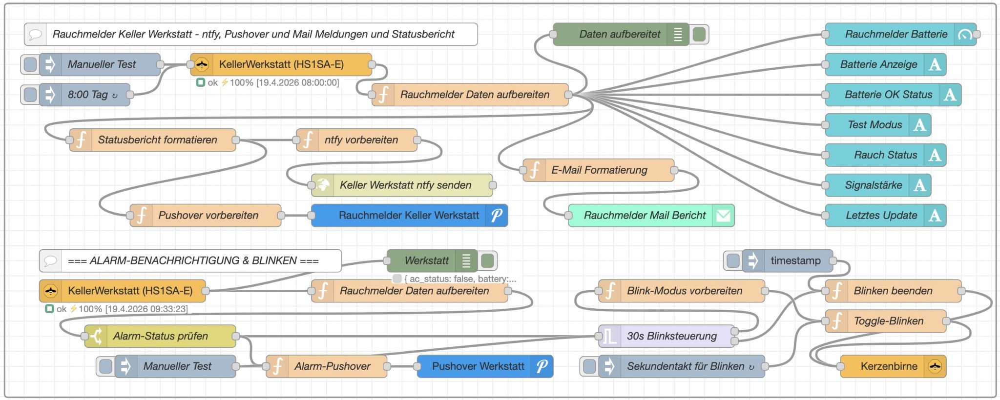
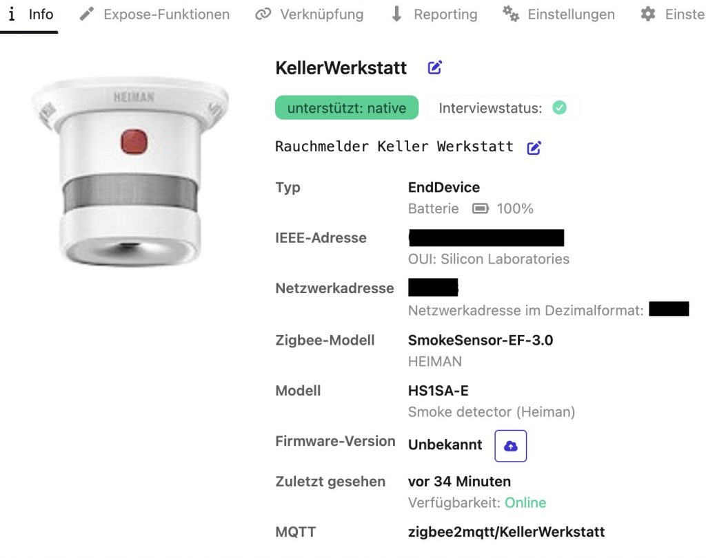
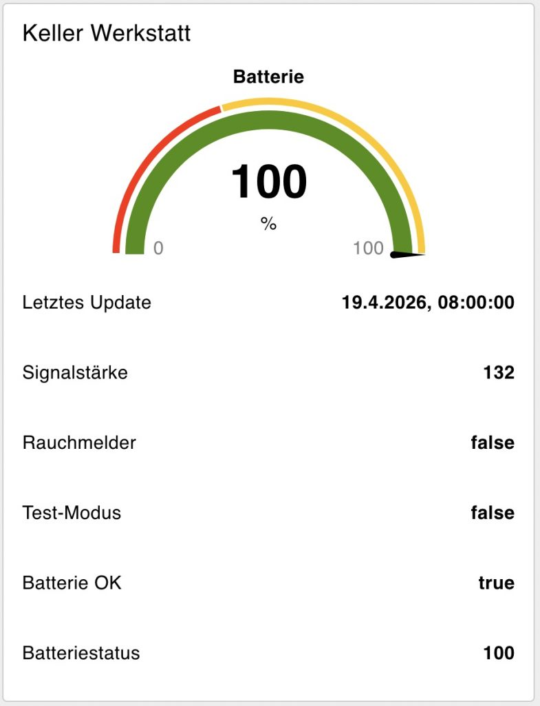

<p align="center">
  
</p>

# Heiman HS1SA-E Smoke Detector with Zigbee2MQTT and Node-RED

[](https://opensource.org/licenses/MIT)
[](https://nodered.org/)

<p align="center">
  
</p>

Integrate the **Heiman HS1SA-E Zigbee smoke detector** into your smart home using Zigbee2MQTT and Node-RED. This project provides a complete Node-RED flow for monitoring the detector, sending alerts via **Mail**, **ntfy**, and **Pushover**, and triggering a visual alarm (e.g., a blinking Zigbee bulb) when smoke is detected.

> **Note on the Heiman HS1SA-E:** This model does **not** support a test alarm via Zigbee, only the physical button. The successor model might include this feature.

## Features

-   **Periodic Status Reports**: Daily (or on-demand) reports on battery, signal strength, test mode, and device status.
-   **Multi-Channel Alerts**:
    -   **Email** (HTML formatted status table)
    -   **Pushover** (High-priority push notifications with alarm sound)
    -   **ntfy.sh** (Self-hostable push notifications)
-   **Visual Alarm**: Blinks a Zigbee smart bulb (e.g., a candle bulb) in red for 30 seconds upon alarm.
-   **Node-RED Dashboard**: UI elements to show battery level, smoke status, signal quality, and more.
-   **Smart Battery Monitoring**: Automatic low-battery warnings (<20%).

## Prerequisites

-   **Hardware**:
    -   Raspberry Pi (or any server running Node-RED)
    -   Zigbee Coordinator (e.g., Sonoff Zigbee 3.0 USB Dongle Plus)
    -   Heiman HS1SA-E Smoke Detector
    -   (Optional) Zigbee bulb for visual alarm
-   **Software**:
    -   [Node-RED](https://nodered.org/) (version 3.0 or later)
    -   [Zigbee2MQTT](https://www.zigbee2mqtt.io/) (with a working MQTT broker)
    -   Node-RED Palettes:
        -   `node-red-contrib-zigbee2mqtt`
        -   `node-red-node-email`
        -   `node-red-contrib-pushover`
        -   `@flowfuse/node-red-dashboard`
    -   Accounts (optional): SMTP server, [Pushover](https://pushover.net/), [ntfy](https://ntfy.sh/) (or self-hosted)

<p align="center">
  
  
</p>

## Pairing the Heiman HS1SA-E with Zigbee2MQTT

The detector is power-sensitive and goes to sleep quickly. To successfully pair it:

1.  Put your Zigbee2MQTT adapter into pairing mode (permit join).
2.  Press and hold the reset button on the smoke detector for about 5 seconds until the LED flashes.
3.  **Crucial step:** During the interview process, press the reset button **every 2-3 seconds** to prevent the device from going back to sleep. You may need to repeat this several times until all data clusters are read successfully.

## Node-RED Flow

The flow consists of three main parts:

1.  **Status Reporting (Polling & Push)**: Polls the detector daily or on demand, formats a report, and sends it via email, Pushover, and ntfy.
2.  **Alarm Handling (Event-driven)**: Listens for the `smoke` attribute from Zigbee2MQTT, triggers push notifications, and starts the visual alarm.
3.  **Visual Alarm (Blinking Bulb)**: Controls a Zigbee bulb to blink red for 30 seconds when an alarm is triggered, then restores the previous state.

### Import the Flow

Copy the entire JSON array from [`flows/heiman-hs1sa-e-flow.json`](./flows/heiman-hs1sa-e-flow.json) and paste it into the Node-RED editor (Menu → Import).

> ⚠️ **Important:** You must configure the following nodes with your own credentials/settings before the flow will work:
> -   **Zigbee2MQTT Server**: All `zigbee2mqtt-get` and `zigbee2mqtt-out` nodes.
> -   **E-mail**: SMTP server, port, credentials.
> -   **Pushover**: Application keys and user keys.
> -   **ntfy**: Topic URL (e.g., `https://ntfy.sh/your-secret-topic`).
> -   **Device IDs & Friendly Names**: Replace the example IDs/names with those from your own Zigbee2MQTT devices.

## Configuration Steps

### 1. Configure Zigbee2MQTT Nodes

- Edit the `zigbee2mqtt-server` configuration node. Set your MQTT broker address, port, and credentials.
- Replace the `friendly_name` and `device_id` in the `zigbee2mqtt-get` and `zigbee2mqtt-in` nodes with those of **your** Heiman detector.
- Do the same for the `zigbee2mqtt-out` node for your Zigbee bulb.

### 2. Set Up Notifications

- **Email**: Edit the `e-mail` node. Enter your SMTP server details, authentication, and recipient address.
- **Pushover**: Double-click the `pushover api` nodes. Select or create a `pushover-keys` configuration. Add your Pushover application key and user key.
- **ntfy**: In the function node `Statusbericht formatieren`, replace the URL `https://ntfy.sh/your-secret-theme-in-ntfy` with your own ntfy topic URL.

### 3. Customize (Optional)

- **Dashboard**: The flow includes a Node-RED Dashboard group (`Keller Werkstatt`). You can modify the UI elements (gauges, text nodes) or remove them if not needed.
- **Alarm Duration**: In the `30s Blinksteuerung` (trigger) node, change the `duration` (currently 30 seconds).
- **Bulb Behavior**: The blinking bulb turns red. You can change the color or brightness in the function nodes `Blink-Modus vorbereiten` and `Toggle-Blinken`.

## Example Status Report (Email)

The email report includes a clear HTML table with battery status, smoke status, test mode, and signal quality. A low battery (<20%) adds a red warning header.

## Troubleshooting

- **Device not pairing / incomplete data**: As mentioned, keep pressing the reset button every 2-3 seconds during the Zigbee2MQTT interview.
- **No updates from the detector**: The device wakes up only periodically (e.g., for battery reports) or on alarm. Use a manual test button (`zigbee2mqtt-get`) if you need an immediate status.
- **Alarm not triggering**: Check the `zigbee2mqtt-in` node. The attribute name is `smoke` (boolean). Ensure your detector's MQTT message contains this field.
- **Bulb does not restore previous state**: The flow stores a mock previous state. To make it dynamic, you would need to query the bulb's current state via `zigbee2mqtt-get` before the alarm.

## Files in this Repository

- `README.md` - This documentation.
- `flows/heiman-hs1sa-e-flow.json` - The exported Node-RED flow (the JSON array you need to import).
- `

## Contributing

Found a bug or have an idea for improvement? Feel free to open an issue or submit a pull request. The flow is version 0.8 – there's room for enhancements (e.g., integrating a real acoustic alarm, supporting multiple detectors).

## License

This project is open-source and available under the [MIT License](LICENSE).

Original blog post (German): [Heiman HS1SA-E Rauchmelder mit ZigBee2MQTT in Node-Red](https://nodered.org](https://edi.teppert.com/heiman-hs1sa-e-rauchmelder-mit-zigbee2mqtt-in-node-red)/)

Author: Edi Teppert


## Flow Structure (Simplified)

```text
[Manual Test] / [Daily Cron]
    │
    ▼
[zigbee2mqtt-get] ──► [Parse Zigbee Data]
                           │
                           ├──► [Node-RED Dashboard (Gauges/Text)]
                           │
                           ▼
              [Format Status Report (Email, Pushover, ntfy)]
                           │
                           ▼
                  (Send via SMTP/Pushover/HTTP)

[zigbee2mqtt-in] (smoke attribute)
    │
    ▼
[Alarm Switch] (if smoke == true)
    ├──► [Pushover High-Priority Alert]
    └──► [30s Blink Trigger] ──► [Blink Candle Bulb (Red)]
